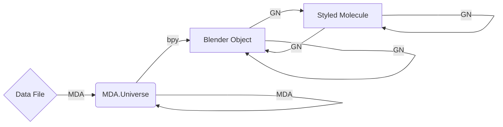

# Structure & Data Flow in Molecular Nodes

The way that data flows and is handled is unconventional, and likely different
to other python packages that you might have experience with. 

There are two main components to the add-on, split into `Import` and
`Manipulation`.

In terms of new features that have to do with MDAnalysis, these will likely
focus on the import step.

If you would like to see how you can create a simple animation from some of the
example data that ships with MDAnalysis, checkout the example file.

## Import

Importing is the more traditional aspect of the add-on. With the help of several
python packages such as `biotite`, `MDAnalysis` and others, various molecular
data formats are parsed.

Once parsed, the data is turned into a 3D mesh, with a vertex for each atom and
an edge for each bond (if information available). Now inside Blender as a
'native' 3D mesh, Geometry Nodes handles all further manipulation of the data,
with additional animations, duplication, selections, and creation of new
geometry in the form of styles.

Below shows the potential flow of data, showing whether MDAnalysis (MDA),
Blender's python module (bpy) or Geometry Nodes (GN) are responsible for
handling that data. Once the data is parsed into a universe, MDA can select,
filter and do other operations on the topology and the trajectory of the
universe. While MDA can update the object inside of Blender by 

## Manipulation

Manipulation is handled entirely by the Geometry Nodes (GN) system that exists
inside of Blender. Inside of Geometry Nodes, users can create node trees to
modify, animate and style their macromolecular structures, through a range of
pre-made node groups which are included inside of the add-on.

The nodes take the underlying atomic data, which is stored as a 3D mesh with
each vertex representing an atom, and each edge between those vertices
representing a bond (where applicable). Both the vertices and edges can store
arbitrary attributes, which we use to store the atomic information with the
atoms and bonds. Currently only numeric, boolean and vector attributes are
supported, but in the future strings and more complex attributes will also be
supported.

Interacting with the nodes via scripting is still quite difficult, the API on
this on Blender's side still needs a lot of improvements. So far the best
approach has been to 'manually' make the node groups inside of Blender, and then
save them and append the pre-made node groups from other `.blend` files to the
current working file. This isn't a fantastic strategy as the `.blend` files are
opaque to `git`, so we just need to rely upon tests for checking if something is
broken. 